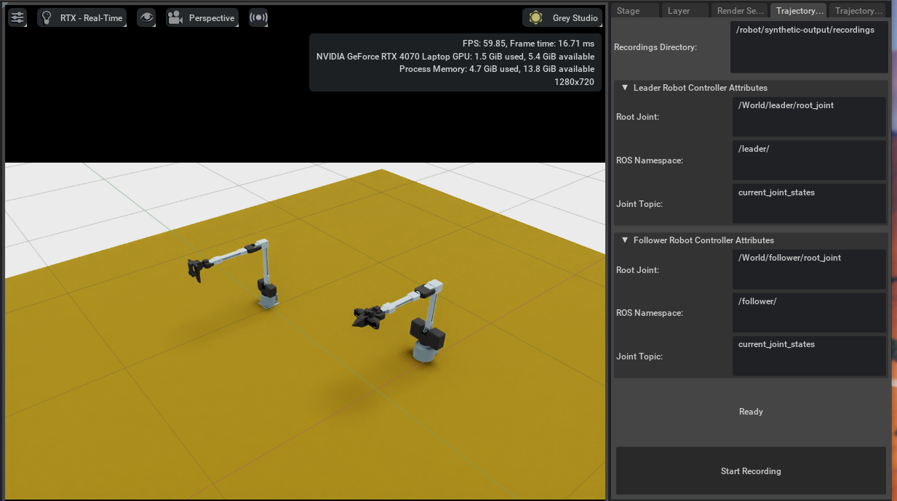
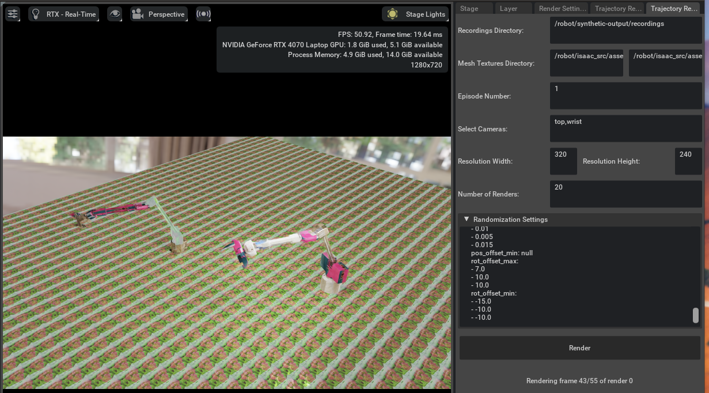

# pi_at_home

---
[](https://github.com/apockill/pi_at_home/actions?query=workflow%3ATest)
[](https://github.com/apockill/pi_at_home/actions?query=workflow%3ALint)
[](https://codecov.io/gh/apockill/pi_at_home)
[](https://github.com/astral-sh/ruff)


---

This is my productionized deployment environment for my real world AI robot policies, 
and a place to create training data for reinforcement learning and imitation learning.

It's also the first project I've built using [create-ros-app](https://github.com/urbanmachine/create-ros-app),
a template I'm developing to make it easier for anyone to create and deploy production 
ready ROS2 applications.

## Project Roadmap
### Phase 1
Phase 1 focuses on leveraging imitation learning + synthetic data to improve the robustness
of imitation-learning datasets with regards to lighting, camera position, and other environmental
factors.

<details>
  <summary>Detailed Status</summary>

- [x] Develop a decent teleoperation interface for the MyArm M&C robot leader/follower arms
- [x] Add isaac-sim support for visualizing above arms
- [x] Learn how to use Replicator to multiplex trajectories of human demonstrations of robot tasks
      done in-simulation
- [x] Create dataset collection tools based on lerobot dataset format
  - [x] Play around, train, and test lerobot policies.
        Done: [Now available via this fork of lerobot](https://github.com/huggingface/lerobot/pull/506)
  - [x] Create isaac -> lerobot conversion scripts
- [ ] Validate synthetic data improves performance
  - [x] Collect a synthetic data dataset for cube->basket task
    - [x] Create STL Assets for cube and basket
    - [x] Add randomization for position and scale of ground plane (and other objects too)
    - [x] Move main-scene to isaac_src/scenes/cube-cup-task.scene and set it up with 25 preset positions
    - [x] record myself moving the robot IRL, and compare to the simulation when rendered @ 30fps
    - [x] Validate observation.state vs action latency (and direction of latency) matches real world captured datasets
         - Measured (with this project): 14 frames latency from action -> observation
         - Measured (with myarm lerobot branch): ~9 frames latency from action -> observation
    - [x] Validate frames are synced as expected, for example, when the robot starts moving in the opposite direction
         - Frames appear synced, however when compared to real-world footage there is a speed scaling issue...
    - [x] Validate "Replay episode" works as expected with episodes collected in Isaac Sim
    - [x] Investigate high latency in myarm loop (it is higher than in lerobot branch)
    - [x] Better calibrate robots so they match position in sim to real world
    - [x] Record position of articulator in sim, not just real robot joints
    - [x] Fix bug with myarm firmware where there's a singularity at the 0 point
    - [x] Actually collect 50 samples
    - [x] Sanity check a few episodes in the Lerobot visualizer before uploading
    - [x] Upload and start training
  - [x] Create a RobotProtocol that emulates latency and speed of my real robot
  - [ ] **In Progress**: Collect a small real dataset for cube->basket task
  - [ ] **In Progress**: Train a model on synthetic data, fine-tune on real data
  - [ ] Add ability to run lerobot models in isaac sim + ROS2
  - [ ] Train a model on real data]
  - [ ] Compare performance of model trained on synthetic data vs real data
- [ ] Create & Document easy workflows for:
  - [ ] Record demonstrations with **real le[dirview.py](../../../../../dirview.py)ader arm** and **simulation follower arm**
  - [x] Multiplex demonstrations using domain randomization, leveraging Replicator learnings above
  - [ ] Training models with mix of real and simulated data
- [ ] Benchmark the sim2real gap with this project, publicize results to open source community
- [ ] Add support for Koch arm and other open-source robot arm

</details>

### Phase 2
Add Reinforcement learning pipelines with ROS2 and Isaac-Sim support

### Phase 3
Support long-horizon tasks involving multiple policies, with a focus on VLMs and 
language-grounded interaction with the robot.

---

## Capabilities

### Simple Teleoperation
The simplest thing you can do is teleoperation with your robot arm copied in Isaac Sim.
To do that, run: 
```shell
docker/launch teleop_myarm
```
This will automatically build and run everything needed for the project.
Then, open http://localhost/ on your browser to view the project logs.

For in-depth documentation on the repository features, read the [About Template](docs/about_template.md) documentation.

### Synthetic Data Generation

There are three steps to synthetic data generation. First, open up the `synthetic_generation` launch profile:

```shell
docker/launch synthetic_generation
```

This will spin up Isaac Sim. Set up extensions using [this guide](docs/adding-custom-extensions.md).
This extension is custom built, and stored in `isaac_src/extensions`. Next, plug in your robot. When using a real world robot, you will need to add a `parameters.overrides.yaml` file to the 
root of `launch-profiles/synthetic_generation` to configure your specific robots drivers.

Next, record an episode! Configure the "Trajectory Recorder" window, and click "Start Recording":


Once you've recorded an episode, you can re-render with domain randomization using the "Trajectory Renderer" extension:


This will generate a configurable number of episodes while varying everything possible-
including joint interpolation to move the robot faster or slower than the original demonstration.

Finally, convert the rendered episodes to a dataset:
```shell
docker/run convert_isaac_to_lerobot \
  --episodes_dir /robot/synthetic-output/recordings \
  --output_dir /robot/synthetic-output/lerobot-fmt \
  --fps 30 \
  --task "Pick up a cube and place it in the basket"
```

### Dependencies

- [Docker](https://docs.docker.com/get-docker/), and optionally [Nvidia Container Toolkit](https://docs.nvidia.com/datacenter/cloud-native/container-toolkit/latest/install-guide.html) for hardware acceleration.
- [Poetry](https://python-poetry.org/docs/), in order to use linting tooling.

---
This repository was initialized by the [create-ros-app](https://github.com/UrbanMachine/create-ros-app) template. Contributions are welcome!
