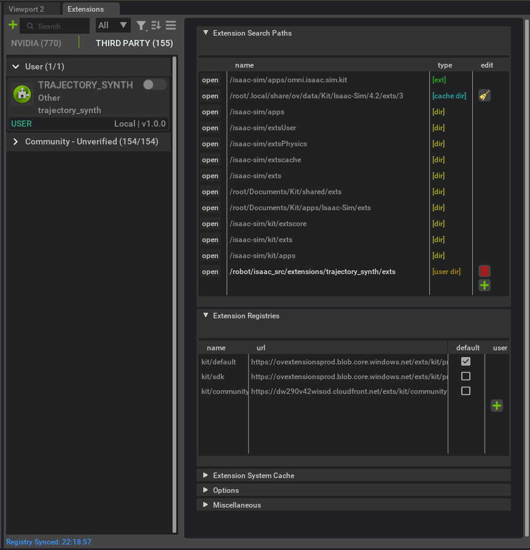

# Add "Trajectory Synth" Extension to Isaac Sim

After you spin up the stack via docker/launch, Isaac Sim will launch. There's one extra
step before you can use the Trajectory Synth extension. You need to add the extension
to the Isaac Sim extensions search path.

Open "Window -> Extensions", click Settings, and add the following path:

Now, turn on the "Trajectory Synth" extension via the toggle!